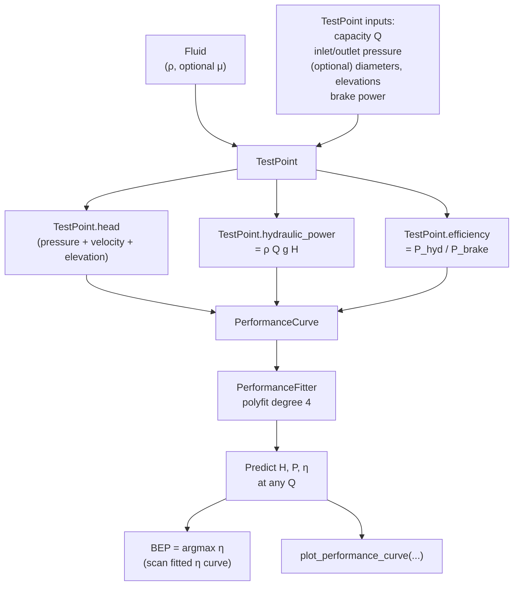

# 01 — Pump performance curves

**Status:** ✅ implemented in `pump.performance_curve`
**Related use cases:** UC-02, UC-04, UC-08, UC-09

## What it is

A pump performance curve is a set of plots that describe everything a centrifugal pump does when you change its flow rate at a fixed speed and impeller diameter. The three curves you always see together are **head vs flow** (`H–Q`), **brake power vs flow** (`P–Q`), and **efficiency vs flow** (`η–Q`). A fourth curve, **net positive suction head required vs flow** (`NPSHr–Q`), is just as important and lives on the same chart.

## Engineering context

Every centrifugal pump has one set of these curves baked into the way it is built. The manufacturer derives them from a controlled water test at the factory (an *API 610 performance test*, an *ISO 9906 acceptance test*). Engineers use the curves to:

- Verify a pump delivered the head and power its nameplate promised (UC-02).
- Find the **best efficiency point** (BEP), the flow at which η peaks. Operating far from BEP shortens bearing life, accelerates seal wear, and increases vibration.
- Find the **minimum continuous stable flow** (low-Q end) and the **runout** (high-Q end of the curve).
- Predict the pump's behaviour under any flow we care about (operating point — concept 03).

## Governing equations

For a measured operating row `(Q, p_suc, p_dis, P_brake)` and a fluid of density `ρ`:

```
Total dynamic head:        H = (p_dis − p_suc) / (ρ g)  +  (v_d² − v_s²)/(2g)  +  (z_d − z_s)
Hydraulic power:           P_hyd = ρ · Q · g · H
Efficiency:                η = P_hyd / P_brake
```

where `v_s`, `v_d` are the suction/discharge fluid velocities (computed from `Q / A` for the suction/discharge cross-sections) and `z_s`, `z_d` are the elevations of the gauges. For the vertical / velocity / elevation head terms see `pump.point.TestPoint.pressure_head`, `velocity_head`, `elevation_head` (`pump/point.py:319-363`).

A polynomial least-squares fit (typically degree 3 for `H`, degree 3–4 for `P`, degree 2–4 for `η`) over `≥ 5` test points gives a smooth curve usable for interpolation:

```
H(Q) = a₀ + a₁ Q + a₂ Q² + a₃ Q³ + a₄ Q⁴
P(Q) = b₀ + b₁ Q + b₂ Q² + b₃ Q³ + b₄ Q⁴
η(Q) = c₀ + c₁ Q + c₂ Q² + c₃ Q³ + c₄ Q⁴
```

API 610 12th ed. §8.3.3.4.3 explicitly authorises a spline or "not less than third order" polynomial fit by least squares.

The BEP is the location of `η_max`: `dη/dQ = 0`. The library finds this by sampling the fitted polynomial over the measured range (see also `PumpLabGUI/screen-results.jsx:38-45` for the JavaScript mirror of the same calculation).

## Computation flowchart



## Library mapping

| Step in flowchart | Library function | Module |
|---|---|---|
| Build a fluid | `Fluid(name, density, **kwargs)` | `pump.utilities.fluid` |
| Build a measured point | `TestPoint(fluid, capacity, **kwargs)` | `pump.point` |
| Compute `H` from a point | `TestPoint.compute_head` (property) | `pump.point` |
| Compute hydraulic power | `TestPoint.compute_hydraulic_power` | `pump.point` |
| Compute efficiency | `TestPoint.compute_efficiency` | `pump.point` |
| Assemble a curve | `PerformanceCurve(fluid, points, polynomial_degree=4)` | `pump.performance_curve` |
| Fit polynomials | `PerformanceFitter.{head_coeffs, efficiency_coeffs, power_coeffs}` (lazy) | `pump.performance_curve` |
| Predict at a flow | `predict_head(Q)`, `predict_efficiency(Q)`, `predict_breaking_power(Q)` | `pump.performance_curve` |
| BEP detection | — *(currently inline in GUI only; library returns no BEP — gap)* | gap |
| Plot the curve | `PerformanceCurve.plot_performance_curve(...)` | `pump.performance_curve` |

**Gap**: the library does not expose `bep`, `runout`, `min_continuous_flow`, or `npshr_curve` properties. These are needed by UC-02 (verdict tables in `PerformanceChecker.check_summary`) and by UC-04 (operating point — concept 03).

## Assumptions and limitations

- **Fixed speed and impeller diameter.** Curves only describe the pump at one operating geometry. For other speeds use the affinity-laws transform (`to_speed`, concept 05). For other diameters: not yet implemented.
- **Single fluid.** All `TestPoint` instances in a `PerformanceCurve` must share the same `Fluid` (the constructor enforces this). To re-base to another fluid use `to_fluid` — but the current implementation does not apply the Hydraulic Institute viscosity correction (ANSI/HI 9.6.7), so it is only valid for *density-only* changes.
- **Polynomial degree default is 4.** That is fine for the typical 6–10 point API 610 test, but it overfits a 4- or 5-point dataset. A minimum-points check is not enforced.
- **No fit quality metric exposed.** R², residuals, and max deviation are not surfaced. Plan to expose `fit_residuals(Q_target)` per metric.
- **The polynomial is evaluated in `m³/h`** (hard-coded in `predict_metric`). Changing the standard capacity unit would silently break predictions until that is replaced by a lookup against `STANDARD_UNITS` — see audit §4.5.

## References

- API 610 / ISO 13709 — *Centrifugal Pumps for Petroleum, Petrochemical and Natural Gas Industries*, 12th ed., §8.3.3 (Performance test).
- ISO 9906:2012 — *Rotodynamic pumps — Hydraulic performance acceptance tests, Grades 1, 2 and 3*.
- Karassik, Messina, Cooper, Heald — *Pump Handbook* (4th ed.), McGraw-Hill, Ch. 2.
- Hydraulic Institute ANSI/HI 9.6.7 — *Effects of Liquid Viscosity on Rotodynamic Pump Performance*.
