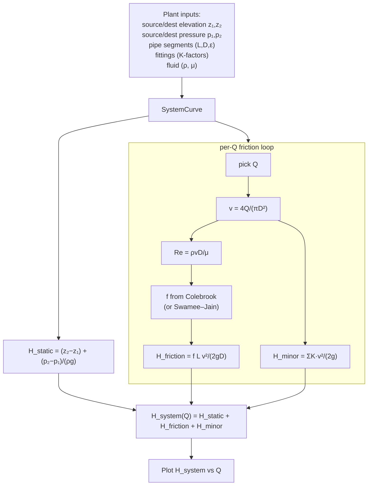

# 02 — System resistance curves

**Status:** ❌ not implemented — **gap**
**Related use cases:** UC-03, UC-04

## What it is

A system resistance curve — also called a *system head curve* — tells you how much head a piping system *demands* in order to push a given flow rate through it. Where a pump curve is a property of the **machine**, the system curve is a property of the **plant**: the pipes, valves, elbows, control valves, heat exchangers, and the elevation difference between source and destination.

Plotted on the same axes as the pump curve, the system curve is what the pump has to overcome.

## Engineering context

A piping engineer draws the system curve to:

- Verify that the pump being procured can deliver the required flow at the head the system imposes (UC-01, UC-04).
- See how the operating point shifts when a control valve closes, a heat exchanger fouls, or a parallel line is opened.
- Quantify how much energy is lost in friction vs how much is doing useful work (static head).

A system curve has two components:

1. **Static head** — the elevation difference plus any pressure difference between the source and destination tanks. Independent of flow.
2. **Dynamic head** — friction losses through pipes plus minor losses through fittings. Grows roughly as `Q²`.

## Governing equations

```
H_system(Q) = H_static + H_friction(Q) + H_minor(Q)

H_static    = (z_2 − z_1)  +  (p_2 − p_1) / (ρ g)

H_friction  = f · (L / D) · v² / (2 g)            [Darcy–Weisbach]
H_minor     = Σ K_i · v² / (2 g)                  [minor / local losses]

v           = Q / A  =  4 Q / (π D²)
Re          = ρ v D / μ                            [Reynolds]
```

Where `f` is the Darcy friction factor — computed from Reynolds number and relative roughness via the Colebrook implicit equation (or its explicit Swamee–Jain approximation). See concept 08 for the friction-factor sub-problem.

For an incompressible single-phase line of constant diameter the dynamic-head term collapses to a clean `Q²` dependence:

```
H_dynamic(Q)  ≈  K_eff · Q²
```

where `K_eff` absorbs `(8 f L / (π² g D⁵))` from friction plus the minor-loss terms.

## Computation flowchart



## Library mapping

The library does not yet contain a system-curve module. The proposed surface for Phase 1:

| Step in flowchart | Proposed library function | Module |
|---|---|---|
| Define a pipe segment | `PipeSegment(length, inner_diameter, roughness, material=None)` | `pump.system` (new) |
| Define a fitting | `Fitting(name, k_factor=…)` *or* `Fitting.elbow_90_long_radius(diameter)` | `pump.system` (new) |
| Build a system | `SystemCurve(fluid, source, destination, segments, fittings, static_head=None)` | `pump.system` (new) |
| Evaluate at a Q | `SystemCurve.head_required(Q) -> Q_` | `pump.system` (new) |
| Sample for plotting | `SystemCurve.curve(q_min, q_max, n=100) -> dict[Q_, Q_]` | `pump.system` (new) |
| Friction factor | `darcy_friction_factor(Re, eps_over_D)` | `pump.hydraulics` (new — concept 08) |

**Dependencies:** concept 08 (pipe hydraulics) must land first; this domain composes that primitive.

## Assumptions and limitations

- **Steady-state, incompressible, single-phase.** No transient analysis, no two-phase flow.
- **Constant fluid properties along the line.** Temperature-driven viscosity / density changes through long heat exchangers are not modelled.
- **One source, one destination.** Networks with multiple sinks (e.g. recycle loops with control valves) need a graph-based extension — out of scope for v1.0.
- **K-factor catalogue must be auditable.** Crane TP-410 and Hydraulic Institute publish slightly different values; the library should expose where each K came from.

## References

- Crane Co. — *Flow of Fluids Through Valves, Fittings, and Pipe*, Technical Paper 410 (TP-410), latest ed.
- Hydraulic Institute ANSI/HI 1.3 — *Rotodynamic Centrifugal Pumps for Design and Application*.
- White, F.M. — *Fluid Mechanics*, 8th ed., Ch. 6 (Viscous flow in ducts).
- AWWA M11 — *Steel Pipe — A Guide for Design and Installation* (for water transmission systems).
