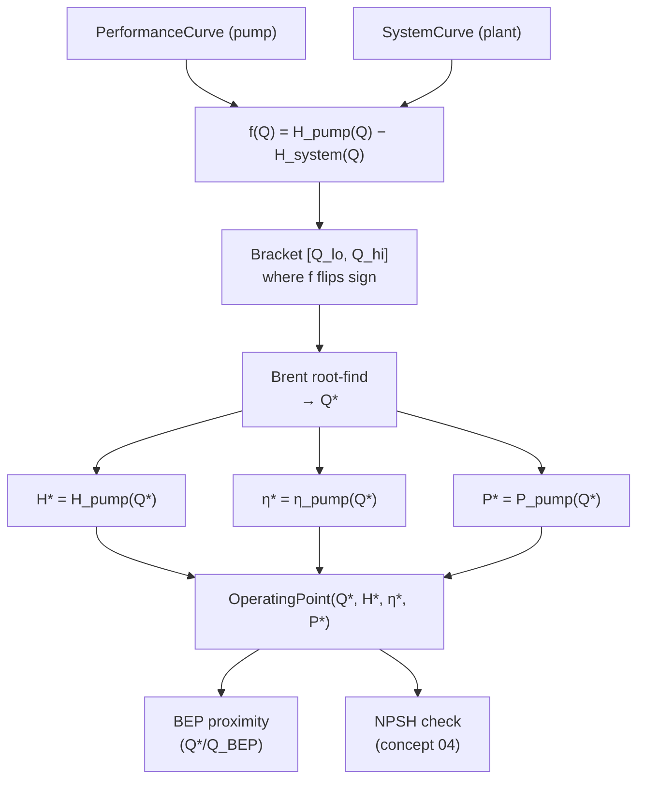

# 03 — Operating point

**Status:** ❌ not implemented — **gap**
**Related use cases:** UC-01, UC-04

## What it is

The operating point of a pump installed in a piping system is the single `(Q, H)` pair where the **pump curve** and the **system curve** cross. At any flow lower than that, the pump produces more head than the system needs and the flow accelerates; at any flow higher, the system needs more head than the pump can produce and the flow decelerates. The intersection is the steady state.

## Engineering context

Finding the operating point is the single most common task in pump engineering. It is what an application engineer does when:

- Selecting a pump for a new piping design (UC-01) — they need to confirm the pump will sit close to BEP at the design flow.
- Verifying an installed pump under new conditions — a tank level dropped, a parallel line opened, a control valve fouled — and they need to know where the new operating point is and whether efficiency dropped, NPSH margin shrank, or motor load exceeded service factor (UC-04).
- Sizing a variable frequency drive — every speed gives a new pump curve and therefore a new operating point on the same system curve (UC-06).

## Governing equations

The operating point `(Q*, H*)` solves:

```
H_pump(Q*)  =  H_system(Q*)
```

This is a one-dimensional root finding problem. Both functions are typically monotonic in the region of interest (`H_pump` decreasing, `H_system` increasing), so the intersection is unique and easy to bracket.

A robust numerical scheme:

1. Bracket `[Q_low, Q_high]` such that `f(Q) = H_pump(Q) − H_system(Q)` has opposite signs at the ends. Use the pump's measured flow range as the natural bracket.
2. Apply Brent's method (or bisection) to find `Q*`. Tolerance: typically `1e-4 × Q_rated`.
3. Evaluate `H* = H_pump(Q*)`, `η* = η_pump(Q*)`, `P* = P_pump(Q*)`.

Once `Q*` is known, the secondary quantities follow immediately from the pump-curve polynomials (concept 01).

## Computation flowchart



## Library mapping

| Step in flowchart | Proposed library function | Module |
|---|---|---|
| Pump curve | `PerformanceCurve` (existing) | `pump.performance_curve` |
| System curve | `SystemCurve` (concept 02) | `pump.system` (new) |
| Define the residual `f` | `_pump_minus_system(Q)` (internal) | `pump.operating` (new) |
| Solve | `operating_point(pump_curve, system_curve) -> OperatingPoint` | `pump.operating` (new) |
| Container | `OperatingPoint(capacity, head, efficiency, power, bep_ratio=…)` | `pump.point` (new dataclass) |
| Multi-pump variant | `operating_point(parallel(pump_a, pump_b), system_curve)` | `pump.operating` (new) |

**Gap details:** the existing `PerformanceCurve.predict_head` returns a `Q_` — perfect input for a root finder. No fundamental obstacle to implementing this in ~30 lines once concept 02 lands.

## Assumptions and limitations

- **Both curves are well-behaved over the same flow range.** Operating points outside the tested range require extrapolating the pump polynomial, which is unsafe at low orders and unstable at high orders — should produce a warning, not a silent value.
- **One pump, one system path.** Branching networks need a graph solver — out of scope for v1.0.
- **No transient dynamics.** The operating point is the *steady* intersection; pump startup, valve trip, and water-hammer transients are not modelled.
- **Static pump curve.** Effects of wear ring clearance opening with hours, or impeller erosion, are not represented — the curve is the as-tested curve.

## References

- Karassik et al. — *Pump Handbook*, 4th ed., §2.2 (System characteristics).
- Hydraulic Institute ANSI/HI 1.3 — *Rotodynamic Centrifugal Pumps for Design and Application*, §1.3.5.
- Press, Teukolsky, Vetterling, Flannery — *Numerical Recipes*, 3rd ed., Ch. 9 (Root finding — Brent's method) for the numerical primitive.
