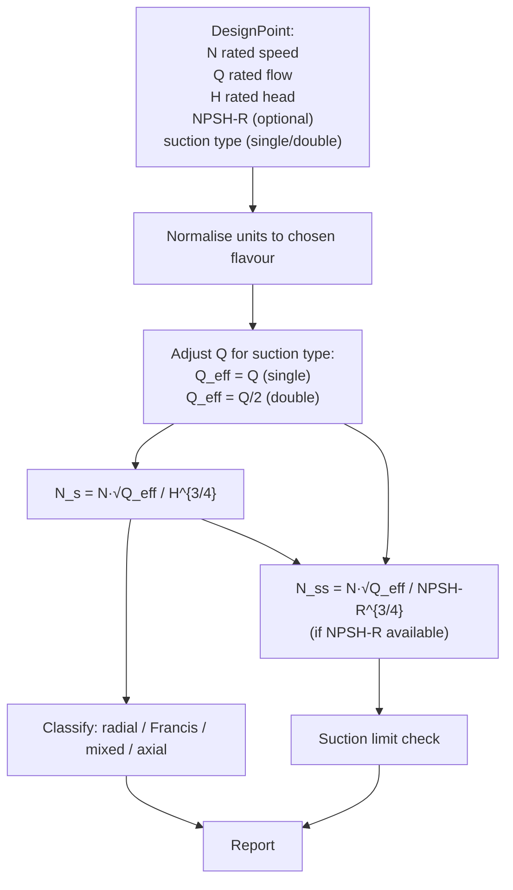

# 06 — Specific speed and pump-type classification

**Status:** ❌ not implemented — **gap**
**Related use cases:** UC-01, UC-10 (educational)

## What it is

**Specific speed** `N_s` is a single number that classifies a centrifugal pump by the shape of its impeller — radial, mixed-flow, or axial. It is a similarity-derived quantity built from the rated speed `N`, rated flow `Q`, and rated head `H`:

```
N_s = N · √Q  /  H^{3/4}
```

Two pumps with the same `N_s` are geometrically similar and have similar curve shapes, even when they handle very different flows and heads.

A second related number, **suction specific speed** `N_ss`, characterises the *suction* side of the impeller — how fast a pump can spin before cavitation becomes structurally limiting:

```
N_ss = N · √Q  /  NPSH-R^{3/4}
```

## Engineering context

Application engineers and selection software use `N_s` to:

- Pick the *family* of pump that fits the duty — high-head/low-flow services need radial impellers (low `N_s`), high-flow/low-head services need mixed-flow or axial impellers (high `N_s`). Using the wrong family wastes 10–20 % efficiency.
- Predict the *shape* of the H–Q curve: low-`N_s` pumps have a steeply rising-to-shutoff curve; high-`N_s` pumps have a flatter curve with a possible droop.
- Cross-check vendor offerings: two pumps quoted for the same duty should land in the same `N_s` band; if one is far off, something is off-design.

`N_ss` is used to set a *speed ceiling* for a given duty — above about `N_ss = 11 000` (US customary) the pump is in the cavitation-erosion danger zone. API 610 and the Hydraulic Institute both publish recommended `N_ss` upper bounds per service severity.

## Governing equations

`N_s` is dimensionally awkward — it has the form of *rpm × √(m³/h) ÷ m^{3/4}* but is conventionally reported as a dimensionless number using specific units. Two flavours dominate:

| Flavour | `N` unit | `Q` unit | `H` unit | Result |
|---|---|---|---|---|
| **US customary** | rpm | gpm | ft | rough range 500 (radial) → 15 000 (axial) |
| **SI metric** | rpm | m³/s | m | rough range 10 → 300 |
| **Dimensionless (rad/s)** | rad/s | m³/s | (gH) m²/s² | rough range 0.02 → 5.0 |

The library must pick a canonical flavour and document the conversion (US customary is the most widely recognised in engineering literature; the SI flavour is the most internally consistent).

Pump-type bands (US customary, double-suction values for `Q` use `Q/2`):

```
N_s  <   2 000   →  radial-flow (low specific speed, high head)
2 000 ≤ N_s < 5 000   →  Francis-vane / mixed-flow
5 000 ≤ N_s < 10 000  →  mixed-flow
N_s  ≥  10 000   →  axial-flow
```

For double-suction pumps `Q` in the formula is *half* the rated flow (because each side of the impeller carries half).

## Computation flowchart



## Library mapping

| Step in flowchart | Proposed library function | Module |
|---|---|---|
| Compute `N_s` | `specific_speed(design_point, flavour='us_customary') -> Q_` | `pump.classification` (new) |
| Compute `N_ss` | `suction_specific_speed(design_point, flavour='us_customary') -> Q_` | `pump.classification` (new) |
| Classify | `pump_type(n_s) -> Literal['radial', 'francis', 'mixed', 'axial']` | `pump.classification` (new) |
| Limit check | `suction_specific_speed_limit(service) -> Q_` | `pump.classification` (new) |
| Visual chart | overlay `N_s` on the GUI | `PumpLabGUI/screen-setup.jsx` (extend) |

`DesignPoint` already accepts `Q_` for rated speed, flow, head, and NPSH-R (as a dynamic attribute), so the data layer is ready.

## Assumptions and limitations

- **Specific speed is *only* the rated-point property.** It does not describe how the pump behaves off-design; for that use the H/P/η curves themselves.
- **The flavour matters.** A doc that quotes `N_s = 4 500` without specifying US-customary vs metric vs dimensionless is ambiguous by a factor of ~150×. The library API must require an explicit flavour.
- **Double-suction adjustment** is on the engineer to declare — there is no way to infer suction geometry from the rated point alone.
- **Cavitation limits via `N_ss`** are empirical bands; treat as guidance, not a hard verdict. Final cavitation check must use NPSH-A vs NPSH-R (concept 04).

## References

- API 610 / ISO 13709, §6.1.7 (Suction specific speed limits).
- Hydraulic Institute ANSI/HI 1.3, §1.3.4 (Specific speed and pump-type classification).
- Karassik et al. — *Pump Handbook*, 4th ed., §2.5 (Specific speed); §2.6 (Suction specific speed and Thoma number).
- Stepanoff, A.J. — *Centrifugal and Axial Flow Pumps*, 2nd ed. (classic reference for the `N_s` bands).
