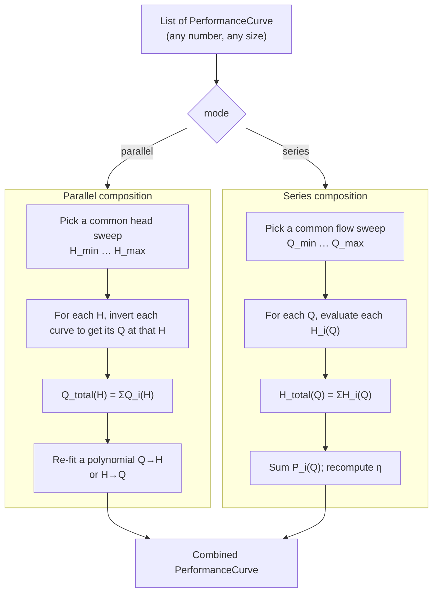

# 07 — Series and parallel operation

**Status:** ❌ not implemented — **gap**
**Related use cases:** UC-08

## What it is

Two or more pumps can be installed in **parallel** (their discharges feed the same header — flows add) or in **series** (one pump discharges into the suction of the next — heads add). Each configuration produces a *combined* performance curve that the system sees as if it came from a single, larger pump.

## Engineering context

Engineers reach for multi-pump configurations when:

- A single pump that meets the duty does not exist, or would be unreasonably large (parallel for very high flow; series for very high head).
- They want **redundancy** — two 100 % parallel pumps so one can be in service while the other is maintained.
- They want **turndown** — multiple small pumps so the plant can match low-flow operation by switching pumps off, rather than throttling a single oversized pump.
- They want to stage pressure across distance — booster pumps in series along a long pipeline.

A sales engineer also needs this when comparing a *single-pump* offer against a *multi-pump* offer for the same duty (UC-08).

## Governing equations

### Parallel (n identical pumps)

```
Q_combined(H)   =  n · Q_single(H)        (sum flows at equal head)
H_combined(Q)   =  H_single(Q / n)        (read single curve at Q/n)
P_combined(Q)   =  n · P_single(Q / n)
η_combined(Q)   =  η_single(Q / n)
```

For *non-identical* pumps the same rule applies pointwise: at any chosen head `H*`, look up the flow each pump delivers at that `H*` and sum the flows.

### Series (n identical pumps)

```
H_combined(Q)   =  n · H_single(Q)        (sum heads at equal flow)
Q_combined      =  Q_single
P_combined(Q)   =  n · P_single(Q)
η_combined(Q)   =  η_single(Q)
```

For non-identical pumps: at any chosen flow `Q*`, sum the heads each pump produces at that `Q*`.

### Practical caveats

- **Cavitation propagation.** In a series stack, NPSH-A at the second pump = discharge pressure of the first pump (which is high), so series rigs do not normally cavitate at the downstream stages. Cavitation at *stage 1* still kills the whole chain.
- **Operating point on a steep system curve.** Adding a second parallel pump does not double the flow — it shifts the operating point along the system curve, and on a steep system curve the gain can be as little as 20–30 % per added pump.
- **Throttle interaction.** Two non-identical pumps in parallel can end up with one running back-toward shutoff while the other carries the load — a stability problem. The combined curve must be checked for monotonicity.

## Computation flowchart



## Library mapping

| Step in flowchart | Proposed library function | Module |
|---|---|---|
| Parallel composition | `parallel(*performance_curves) -> PerformanceCurve` | `pump.combine` (new) |
| Series composition | `series(*performance_curves) -> PerformanceCurve` | `pump.combine` (new) |
| Invert H → Q for a curve | `PerformanceCurve.invert_head(H) -> Q_` | `pump.performance_curve` (extend) |
| Resample / re-fit a combined curve | re-use `PerformanceFitter` | `pump.performance_curve` |
| Plot multiple curves on one chart | `multi_curve_plot([(curve, label), …])` | `pump.performance_curve` (extend) |

`PerformanceCurve` already enforces single-fluid for its constituents; the new `parallel` / `series` helpers must enforce the same and surface a clear error if curves use different fluids.

## Assumptions and limitations

- **Each curve is valid at the same speed.** Mixing curves at different speeds requires first transforming each one with `to_speed` (concept 05).
- **Synchronous start.** The combined curve is the *steady-state* combined curve; pump-out-of-sequence (one pump just started while the other is at rated speed) is not modelled.
- **No interaction between pumps in series.** Each pump sees the discharge of the previous one as its suction; for a typical low-density water service the inter-stage interaction is just a pressure boost. For high-density or compressible (vapourising-edge) services the inter-stage thermodynamics matter.
- **Combined-curve fit quality.** When component curves are dissimilar (e.g. a small + a large pump in parallel), the combined curve can have a kink at the head where the smaller pump runs out — a polynomial fit will smooth that out misleadingly. The library should expose both the sampled (Q, H) sequence *and* the polynomial fit so the engineer can choose.

## References

- Karassik et al. — *Pump Handbook*, 4th ed., §2.4 (Multiple-pump operation).
- Hydraulic Institute ANSI/HI 1.3, §1.3.5.3 (Combined characteristic curves).
- API 610, Annex F (Spare and parallel operation considerations).
