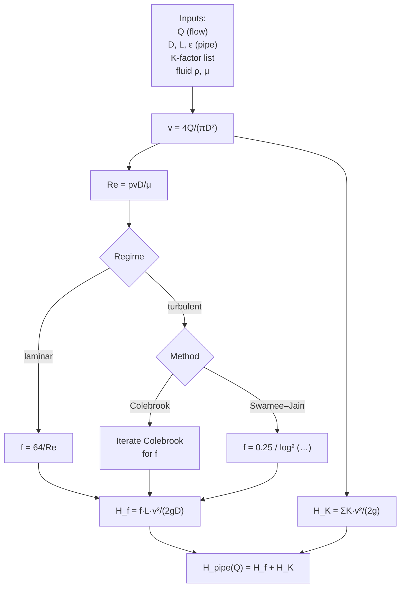

# 08 — Pipe hydraulics (Darcy–Weisbach, friction factor, K-factors)

**Status:** ❌ not implemented — **gap**
**Related use cases:** UC-03 (system curves consume this primitive)

## What it is

Pipe hydraulics is the body of equations and correlations that tell you how much head a fluid loses as it flows through pipes, valves, elbows, and other fittings. It is the primitive that the **system resistance curve** (concept 02) and the **NPSH analysis** (concept 04) both build on.

There are two widely-used formulations:

- **Darcy–Weisbach + Colebrook** — the physically grounded approach. Friction factor `f` depends on Reynolds number and relative roughness. Works for any Newtonian fluid, any pipe, any flow regime.
- **Hazen–Williams** — an empirical correlation widely used in water-supply engineering (AWWA). Only valid for water at ambient temperature, but simpler to compute.

The library should default to Darcy–Weisbach and offer Hazen–Williams as an explicit alternative for water-service work.

## Engineering context

Every system curve, every NPSH-A calculation, every "is my suction line long enough to require a 6-inch pipe instead of 4-inch?" sanity check goes through pipe hydraulics. It is the single most reused piece of math in pump engineering.

Engineers reach for it when:

- Sizing a suction line so NPSH-A stays above NPSH-R.
- Sizing a discharge line so friction loss does not eat the pump's head budget.
- Reviewing a piping isometric to see where pressure drop lives.
- Diagnosing why a pump is running off-curve — a fouled heat exchanger has just doubled `K_eff` in the discharge line.

## Governing equations

### Velocity and Reynolds number

```
v   =  Q / A    where A = π D² / 4
Re  =  ρ v D / μ   =   v D / ν
```

`ν = μ/ρ` is the kinematic viscosity.

### Flow regime

```
Re < 2 300            laminar
2 300 ≤ Re < 4 000    transition (avoid — pressure drop unpredictable)
Re ≥ 4 000            turbulent
```

### Friction factor `f` (Darcy)

**Laminar**:
```
f = 64 / Re
```

**Turbulent** (smooth or rough) — Colebrook implicit:
```
1/√f  =  −2 log₁₀ ( ε/(3.7 D)  +  2.51 / (Re √f) )
```

**Turbulent — Swamee–Jain explicit** (within 1 % of Colebrook for `Re ≥ 5 000`, `1e-6 ≤ ε/D ≤ 1e-2`):
```
f  =  0.25  /  [ log₁₀ ( ε/(3.7 D)  +  5.74 / Re^{0.9} ) ]²
```

### Head loss

**Darcy–Weisbach (straight pipe)**:
```
H_f  =  f · (L / D) · v² / (2 g)
```

**Minor losses (fittings)**:
```
H_K  =  Σ K_i · v² / (2 g)
```

where each `K_i` is a tabulated loss coefficient. Crane TP-410 and the Hydraulic Institute publish K-factor catalogues; values differ by 10–20 % between sources — the library must record the source per fitting.

**Hazen–Williams (water only, customary units)**:
```
H_f  =  10.67 · L · Q^{1.852}  /  (C^{1.852} · D^{4.87})         [SI: H in m, L in m, Q in m³/s, D in m]
```

where `C` is the Hazen–Williams roughness coefficient (140 for new steel, 100 for old steel, 130 for ductile iron, 150 for plastic — tabulated).

## Computation flowchart



## Library mapping

| Step in flowchart | Proposed library function | Module |
|---|---|---|
| Reynolds number | `reynolds(rho, v, D, mu) -> Q_` | `pump.hydraulics` (new) |
| Friction factor — laminar | `friction_factor_laminar(Re)` | `pump.hydraulics` (new) |
| Friction factor — Colebrook | `friction_factor_colebrook(Re, eps_over_D, tol=1e-6)` | `pump.hydraulics` (new) |
| Friction factor — Swamee–Jain | `friction_factor_swamee_jain(Re, eps_over_D)` | `pump.hydraulics` (new) |
| Auto-pick friction factor | `friction_factor(Re, eps_over_D, method='swamee_jain')` | `pump.hydraulics` (new) |
| Darcy head loss | `darcy_weisbach(f, L, D, v) -> Q_` | `pump.hydraulics` (new) |
| Hazen–Williams head loss | `hazen_williams(C, L, D, Q) -> Q_` | `pump.hydraulics` (new) |
| K-factor catalogue | `K_FACTORS: dict[str, dict[str, float]]` (Crane TP-410) | `pump.hydraulics.catalogue` (new) |
| Pipe-roughness catalogue | `ROUGHNESS: dict[str, Q_]` (new steel, drawn tubing, …) | `pump.hydraulics.catalogue` (new) |
| Standard pipe schedule | `pipe_id(nominal_size, schedule) -> Q_` | `pump.hydraulics.catalogue` (new) |

The library has no current module to extend — this is greenfield. The catalogue (K-factors, roughness, pipe schedules) is the highest-value sub-component because it removes the most error-prone manual look-ups from engineering work.

## Assumptions and limitations

- **Newtonian, incompressible, single-phase flow.** Non-Newtonian slurries, two-phase flow, and compressible gas flow are out of scope.
- **Fully-developed flow.** Entrance effects at pipe inlets, recirculation downstream of valves, and developing flow in short sections are not modelled; they are captured (approximately) by K-factors on the fittings.
- **Adiabatic walls.** No heat exchange with the pipe wall — the bulk fluid temperature is constant. For long lines with significant temperature drop, viscosity changes need to be re-evaluated.
- **Surface roughness `ε` is a catalogue value, not a measurement.** Real plant pipes corrode, foul, and develop scale; the library should expose a *design-margin* multiplier.
- **K-factor catalogue is conservative by source.** Document which catalogue each K came from; do not silently switch sources.

## References

- Crane Co. — *Flow of Fluids Through Valves, Fittings, and Pipe*, Technical Paper 410 (TP-410) — the K-factor reference.
- White, F.M. — *Fluid Mechanics*, 8th ed., Ch. 6 (Viscous flow in ducts), for derivations.
- Moody, L.F. — *Friction factors for pipe flow*, Trans. ASME, 1944 — the Moody diagram.
- Colebrook, C.F. — *Turbulent flow in pipes…*, J. Inst. Civ. Eng., 1939 — the implicit friction-factor equation.
- Swamee, P.K. and Jain, A.K. — *Explicit equations for pipe-flow problems*, J. Hydraulics Div., ASCE, 1976.
- AWWA M11 — *Steel Pipe — A Guide for Design and Installation* (Hazen–Williams `C` coefficients for water service).
